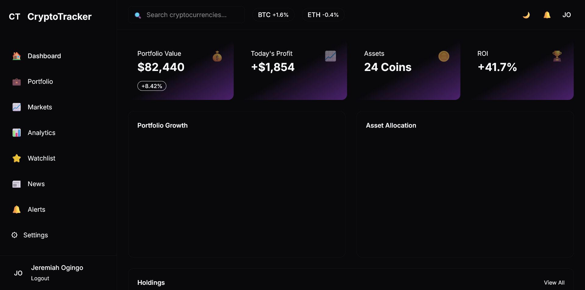
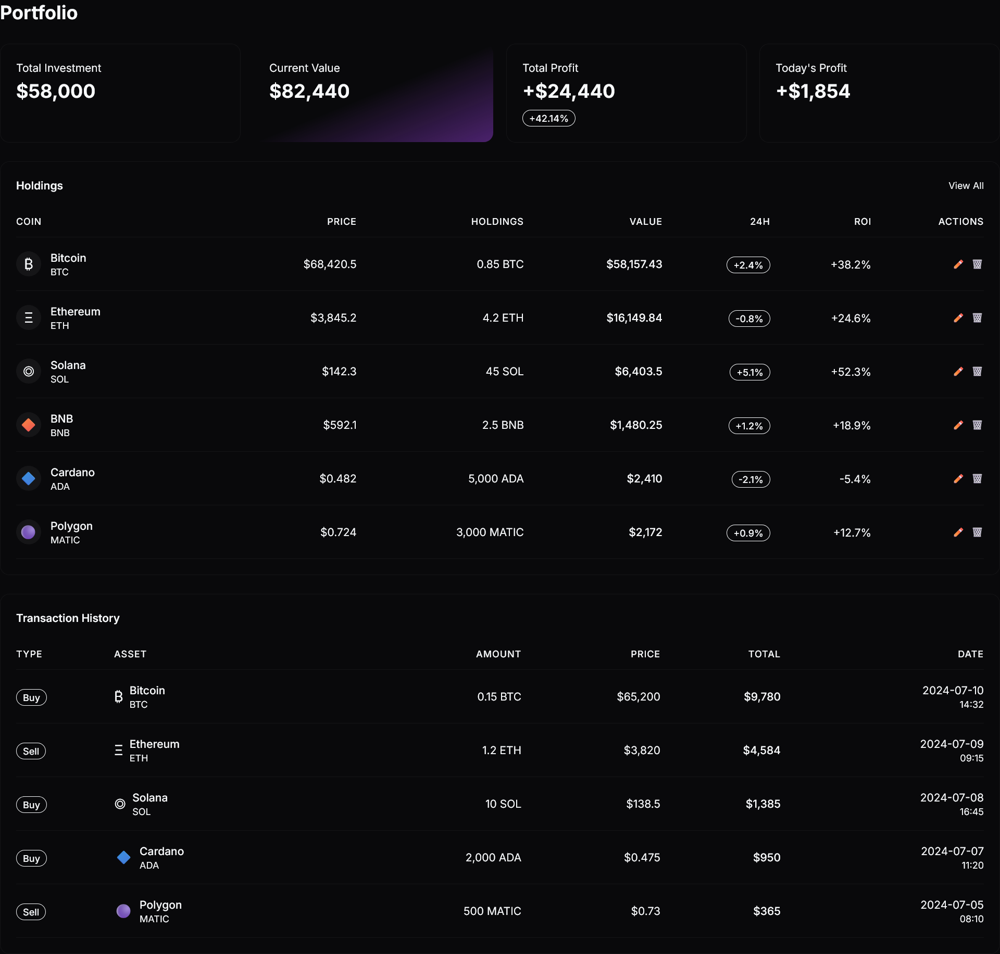
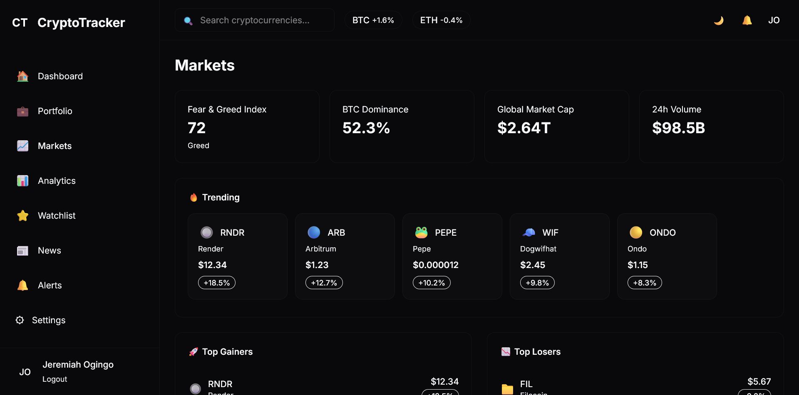

# ₿ Crypto Portfolio Tracker

> A modern cryptocurrency portfolio management dashboard that enables investors to track digital assets across multiple exchanges, monitor market trends, analyze portfolio performance, and make informed investment decisions using real-time market data.


---

## 📖 Overview

Crypto Portfolio Tracker is a professional web application designed to help cryptocurrency investors monitor, analyze, and manage their investments from a single dashboard.

The application aggregates live cryptocurrency market data from public APIs and presents detailed portfolio analytics through beautiful, interactive charts and dashboards. Whether you're a casual investor or an active trader, the platform provides the insights needed to understand portfolio performance and market movements.

---

# 📸 Screenshots

### Dashboard



### Portfolio Overview



### Analytics


### Market Page



### Watchlist


---

# ✨ Features

## 📊 Portfolio Dashboard

- Portfolio overview
- Total portfolio balance
- Daily gains/losses
- Portfolio performance
- Portfolio growth graph
- Total assets owned
- Net investment value

---

## 💰 Live Cryptocurrency Prices

- Live market prices
- Price updates
- Market capitalization
- 24-hour trading volume
- 24-hour price changes
- Market rankings

---

## 📈 Portfolio Analytics

- Daily performance
- Weekly performance
- Monthly performance
- Yearly performance
- Lifetime returns
- Profit/Loss calculations
- ROI calculations

---

## 📉 Interactive Charts

- Historical performance
- Portfolio growth
- Asset allocation
- Price history
- Portfolio trends
- Market comparison

---

## 🪙 Asset Management

- Add cryptocurrencies
- Edit holdings
- Delete holdings
- Investment tracking
- Average purchase price
- Quantity management

---

## ⭐ Watchlists

- Save favorite cryptocurrencies
- Track coins
- Quick market overview
- Personalized watchlists

---

## 🔔 Price Alerts

- Target price alerts
- Percentage gain alerts
- Percentage loss alerts
- Browser notifications

---

## 📰 Market News

- Latest crypto news
- Market analysis
- Coin updates
- Industry announcements
- Regulatory news

---

## 🌙 User Experience

- Responsive design
- Mobile-first interface
- Dark mode
- Light mode
- Smooth animations
- Modern dashboard

---

# 🏗️ System Architecture

```
                    Public Crypto APIs
                            │
                            ▼
                  Data Fetching Services
                            │
                            ▼
                TanStack React Query Cache
                            │
                            ▼
                  Business Logic Layer
                            │
        ┌───────────────────┼───────────────────┐
        ▼                   ▼                   ▼
 Dashboard           Portfolio Manager      Watchlists
        │                   │                   │
        └───────────────┬───────────────────────┘
                        ▼
               Interactive UI Components
                        │
                        ▼
                     End User
```

---

# 🛠️ Tech Stack

## Frontend

- Next.js
- React
- TypeScript
- Tailwind CSS

---

## Charts & Visualization

- Chart.js
- react-chartjs-2

---

## Data Fetching

- Axios
- TanStack React Query

---

## Authentication

- NextAuth.js

---

## Forms

- React Hook Form
- Zod

---

## Styling

- Tailwind CSS
- Lucide React Icons
- Framer Motion

---

## Theme

- next-themes

---

## Date Utilities

- date-fns

---

# 📂 Project Structure

```
crypto-portfolio-tracker/
│
├── public/
│   ├── icons/
│   ├── images/
│   └── screenshots/
│
├── src/
│
│   ├── app/
│   │   ├── dashboard/
│   │   ├── portfolio/
│   │   ├── analytics/
│   │   ├── markets/
│   │   ├── watchlist/
│   │   ├── news/
│   │   ├── alerts/
│   │   ├── settings/
│   │   └── layout.tsx
│   │
│   ├── components/
│   │   ├── charts/
│   │   ├── dashboard/
│   │   ├── layout/
│   │   ├── portfolio/
│   │   ├── tables/
│   │   ├── cards/
│   │   ├── navbar/
│   │   └── ui/
│   │
│   ├── context/
│   │
│   ├── hooks/
│   │
│   ├── services/
│   │   ├── coingecko.ts
│   │   ├── binance.ts
│   │   ├── news.ts
│   │   └── alerts.ts
│   │
│   ├── lib/
│   │
│   ├── types/
│   │
│   ├── utils/
│   │
│   ├── constants/
│   │
│   └── styles/
│
├── .env.local
├── package.json
├── tsconfig.json
└── README.md
```

---

# ⚙️ Installation

## Clone Repository

```bash
git clone https://github.com/yourusername/crypto-portfolio-tracker.git
```

```bash
cd crypto-portfolio-tracker
```

---

## Install Dependencies

```bash
npm install
```

---

## Configure Environment Variables

Create a `.env.local`

```env
NEXT_PUBLIC_COINGECKO_API=
NEXT_PUBLIC_BINANCE_API=
NEXT_PUBLIC_NEWS_API=
NEXTAUTH_SECRET=
NEXTAUTH_URL=http://localhost:3000
```

---

## Run Development Server

```bash
npm run dev
```

Open

```
http://localhost:3000
```

---

# 📊 Dashboard Modules

## 🏠 Dashboard

Displays

- Portfolio Summary
- Net Worth
- Today's Profit/Loss
- Portfolio Performance
- Trending Coins

---

## 💼 Portfolio

Manage

- Holdings
- Investment Amount
- Buy Price
- Quantity
- ROI

---

## 📈 Analytics

Visualize

- Asset Allocation
- Portfolio Growth
- Profit Trends
- Historical Performance

---

## 🌍 Markets

Browse

- Top Gainers
- Top Losers
- Trending Coins
- Market Rankings

---

## ⭐ Watchlist

Monitor

- Favorite Coins
- Custom Lists
- Live Prices

---

## 🔔 Alerts

Receive

- Price Notifications
- Percentage Change Alerts
- Portfolio Notifications

---

## ⚙️ Settings

Customize

- Currency
- Theme
- Notifications
- Account

---

# 🔗 API Integrations

## CoinGecko

- Live Prices
- Historical Data
- Coin Information
- Market Statistics

---

## Binance

- Exchange Prices
- Market Tickers
- Trading Data

---

## CryptoCompare

- Historical Charts
- Price History

---

## NewsAPI

- Cryptocurrency News
- Market Updates

---

# 📈 Planned Improvements

- Portfolio synchronization across exchanges
- Exchange API integration
- NFT portfolio tracking
- Staking rewards tracking
- DeFi investment tracking
- AI portfolio recommendations
- Tax reporting
- Export reports to PDF
- CSV import/export
- Multi-language support
- Offline mode
- Progressive Web App
- Mobile application

---

# 🧪 Future Integrations

- Coinbase API
- Kraken API
- Bybit API
- OKX API
- KuCoin API
- CoinMarketCap API

---

# 🚀 Deployment

Build production version

```bash
npm run build
```

Start production server

```bash
npm start
```

Deploy easily using

- Vercel
- Netlify
- Railway
- Render

---

# 🤝 Contributing

Contributions are welcome.

1. Fork the repository

2. Create a feature branch

```bash
git checkout -b feature/NewFeature
```

3. Commit changes

```bash
git commit -m "Add new feature"
```

4. Push changes

```bash
git push origin feature/NewFeature
```

5. Open a Pull Request

---

# 📄 License

This project is licensed under the MIT License.

---

# 👨‍💻 Author

**Jeremiah Ogingo**

Software Engineer

GitHub: https://github.com/Jeremiahogingo

LinkedIn: https://linkedin.com/in/jeremiah-omondi-30540432a

Portfolio: https://my-portfolio-eta-six-33.vercel.app

---

## ⭐ Support

If you found this project useful, consider giving it a **⭐ Star** on GitHub. It helps others discover the project and motivates continued development.

---