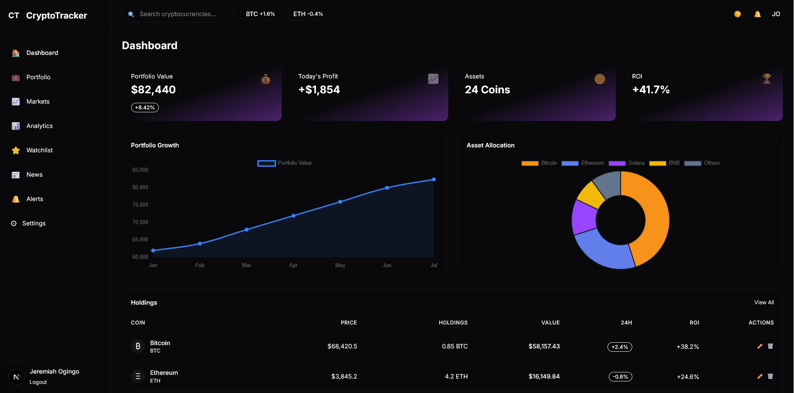
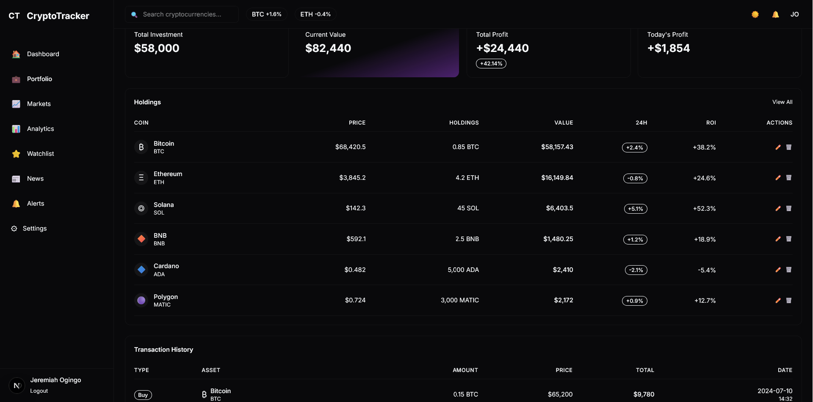
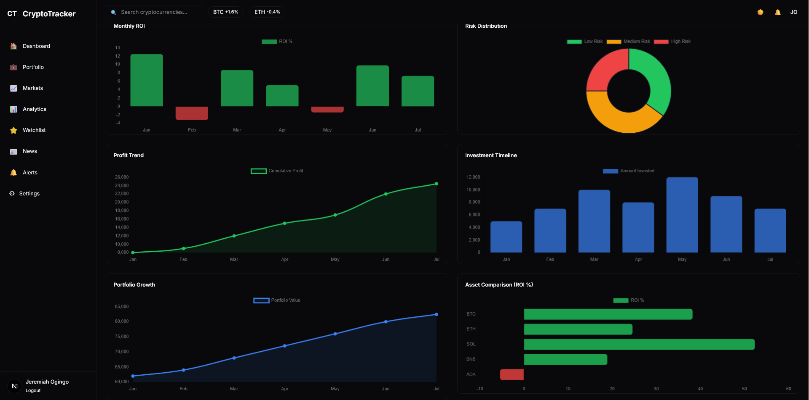
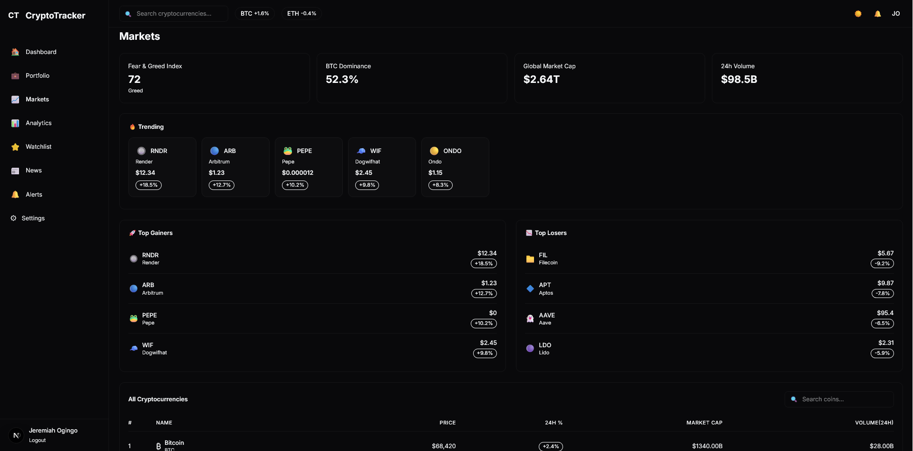
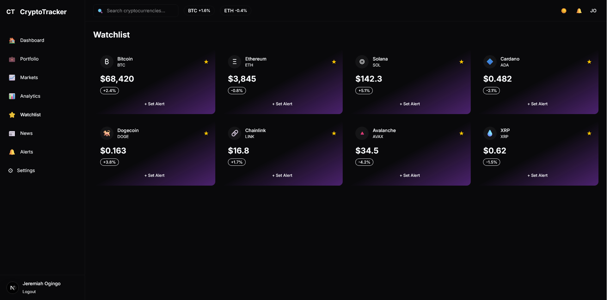

# ₿ Crypto Portfolio Tracker

> A secure, full-stack cryptocurrency portfolio management and analytics platform for monitoring digital assets, analyzing investment performance, tracking market movements, and managing portfolio risk from a unified dashboard.


---

## 📖 Overview

**Crypto Portfolio Tracker** is a modern web application designed to help cryptocurrency investors manage and analyze their digital-asset portfolios from a single platform.

The system combines portfolio management, market data, performance analytics, interactive visualizations, watchlists, price alerts, and market news into one dashboard.

The project is designed with a strong focus on:

- Secure user and portfolio management
- Real-time and historical market data
- Investment performance analysis
- Data visualization
- API integration
- Responsive user experience
- Scalable software architecture

The platform is intended to function as a **portfolio management and decision-support system**, not as a custodial cryptocurrency wallet or automatic trading platform.

---

## 🎯 Problem Statement

Cryptocurrency investors may hold different assets across multiple wallets and exchanges, making it difficult to obtain a clear view of their overall investment performance.

Common challenges include:

- Tracking assets across different platforms
- Calculating overall profit and loss
- Monitoring portfolio growth
- Comparing individual asset performance
- Understanding asset allocation and concentration
- Keeping track of market movements
- Receiving timely price notifications

This application addresses these challenges by providing a centralized portfolio management and analytics environment.

---

## ✨ Core Features

### 📊 Portfolio Dashboard

- Total portfolio value
- Net invested value
- Daily profit/loss
- Overall profit/loss
- Portfolio ROI
- Number of assets held
- Portfolio performance overview
- Portfolio growth visualization

### 💼 Portfolio Management

- Add cryptocurrency holdings
- Record investment transactions
- Edit and delete transactions
- Track quantity owned
- Track average purchase price
- Calculate current value
- Calculate realized and unrealized performance

### 🌍 Cryptocurrency Markets

- Live cryptocurrency prices
- Market capitalization
- 24-hour volume
- 24-hour price changes
- Market rankings
- Top gainers
- Top losers
- Trending assets
- Search and filtering

### 📈 Portfolio Analytics

- Daily performance
- Weekly performance
- Monthly performance
- Yearly performance
- Lifetime returns
- ROI analysis
- Profit/loss trends
- Portfolio growth
- Asset performance comparison
- Asset allocation analysis

### 📉 Interactive Visualizations

- Portfolio performance charts
- Historical price charts
- Portfolio growth charts
- Asset allocation charts
- Performance comparison charts
- Market trend visualizations

### ⭐ Watchlist

- Add favorite cryptocurrencies
- Remove assets from watchlists
- Monitor price movements
- Monitor percentage changes
- View quick market statistics

### 🔔 Price Alerts

- Target-price alerts
- Percentage-change alerts
- Gain/loss notifications
- Browser notifications
- Alert management

### 📰 Market News

- Cryptocurrency news
- Market updates
- Coin-specific news
- Industry announcements
- Regulatory developments

### ⚙️ User Settings

- Account management
- Currency preferences
- Theme selection
- Notification preferences
- Application preferences

---

## 🔐 Security

Security is a core design consideration of the platform.

The system follows a **non-custodial approach**, meaning the application does not store users' cryptocurrency private keys or seed phrases and does not directly hold users' funds.

Planned security measures include:

- Secure authentication
- Password hashing
- Session management
- Role-based authorization
- Input validation
- API rate limiting
- HTTPS/TLS communication
- Secure environment variables
- Protection against unauthorized portfolio access
- Encrypted storage of sensitive credentials where required
- Audit logging for security-sensitive activities
- Restricted, read-only exchange API permissions

### Exchange API Security

Where exchange synchronization is supported, the system is designed to use **read-only API credentials** whenever possible.

Trading and withdrawal permissions should remain disabled.

```text
User
  │
  ▼
Crypto Portfolio Tracker
  │
  ▼
Secure Backend
  │
  ▼
Read-Only Exchange API
````

Private keys and seed phrases are never required by the application.

---

## 🏗️ System Architecture

```text
                   External Data Sources
                ┌──────────┬──────────┬──────────┐
                │          │          │          │
                ▼          ▼          ▼          ▼
           CoinGecko    Binance    News API   Other Sources
                │          │          │
                └──────────┴──────┬───┘
                                  ▼
                         Data Service Layer
                                  │
                                  ▼
                       TanStack Query Cache
                                  │
                                  ▼
                        Business Logic Layer
                                  │
             ┌────────────────────┼────────────────────┐
             │                    │                    │
             ▼                    ▼                    ▼
        Dashboard          Portfolio Manager       Analytics
             │                    │                    │
             └────────────────────┼────────────────────┘
                                  ▼
                         UI / Visualization
                                  │
                                  ▼
                                User
```

The application is structured into separate presentation, business logic, data-access, and service layers to improve maintainability and scalability.

---

## 🛠️ Technology Stack

### Frontend

* Next.js 15
* React
* TypeScript
* Tailwind CSS

### Data Visualization

* Chart.js
* react-chartjs-2

### Data Fetching

* Axios
* TanStack React Query

### Authentication

* NextAuth.js / Auth.js

### Forms & Validation

* React Hook Form
* Zod

### UI & Animation

* Lucide React
* Framer Motion

### Theme Management

* next-themes

### Utilities

* date-fns

### Planned Backend & Data Layer

* PostgreSQL
* Prisma or equivalent ORM
* REST APIs
* WebSockets for selected real-time data streams

---

## 🗂️ Project Structure

```text
crypto-portfolio-tracker/
│
├── public/
│   ├── icons/
│   ├── images/
│   └── screenshots/
│
├── src/
│   ├── app/
│   │   ├── dashboard/
│   │   ├── portfolio/
│   │   ├── analytics/
│   │   ├── markets/
│   │   ├── watchlist/
│   │   ├── news/
│   │   ├── alerts/
│   │   ├── settings/
│   │   └── layout.tsx
│   │
│   ├── components/
│   │   ├── charts/
│   │   ├── dashboard/
│   │   ├── layout/
│   │   ├── portfolio/
│   │   ├── tables/
│   │   ├── cards/
│   │   ├── navbar/
│   │   └── ui/
│   │
│   ├── context/
│   ├── hooks/
│   ├── services/
│   ├── lib/
│   ├── types/
│   ├── utils/
│   └── constants/
│
├── .env.local
├── package.json
├── tsconfig.json
├── next.config.ts
└── README.md
```

---

## 🔗 API Integrations

### CoinGecko

Used for cryptocurrency market information such as:

* Current prices
* Market capitalization
* Historical market data
* Asset information
* Market statistics

### Binance

Planned for:

* Exchange market data
* Market tickers
* Selected real-time price streams
* Optional exchange portfolio synchronization

### News Provider

Used for:

* Cryptocurrency news
* Market updates
* Industry announcements
* Regulatory news

> API providers may change as the project evolves. The service layer is designed to make external integrations replaceable without redesigning the user interface.

---

## 📸 Screenshots

### Dashboard



### Portfolio



### Analytics



### Markets



### Watchlist



---

## 📊 Main System Modules

| Module    | Purpose                                             |
| --------- | --------------------------------------------------- |
| Dashboard | Portfolio summary and market overview               |
| Portfolio | Manage holdings and transactions                    |
| Analytics | Analyze returns, growth, allocation and performance |
| Markets   | Explore cryptocurrency market data                  |
| Watchlist | Monitor selected assets                             |
| Alerts    | Manage price and percentage alerts                  |
| News      | View cryptocurrency market news                     |
| Settings  | Manage account and application preferences          |

---

## 🧮 Key Analytics

The system calculates and visualizes important portfolio metrics including:

### Portfolio Value

```text
Portfolio Value =
Σ (Asset Quantity × Current Market Price)
```

### Profit / Loss

```text
Profit/Loss =
Current Portfolio Value − Invested Capital
```

### ROI

```text
ROI (%) =
((Current Value − Invested Value) / Invested Value) × 100
```

Additional analytics can include:

* Asset allocation percentage
* Historical portfolio growth
* Individual asset performance
* Investment timeline
* Portfolio concentration
* Risk distribution

---

## 🧪 Testing

The project will include testing at multiple levels:

* Unit testing
* Component testing
* API testing
* Integration testing
* Authentication and authorization testing
* Security testing
* End-to-end testing

Particular attention will be given to testing:

* Portfolio calculations
* Transaction handling
* Unauthorized data access
* API failures
* Invalid user input
* Alert conditions

---

## ⚙️ Installation

### 1. Clone the Repository

```bash
git clone https://github.com/Jeremiahogingo/crypto-portfolio-tracker.git
cd crypto-portfolio-tracker
```

### 2. Install Dependencies

```bash
npm install
```

### 3. Configure Environment Variables

Create a `.env.local` file:

```env
# Authentication
NEXTAUTH_SECRET=
NEXTAUTH_URL=http://localhost:3000

# Server-side API credentials
COINGECKO_API_KEY=
BINANCE_API_KEY=
BINANCE_API_SECRET=
NEWS_API_KEY=

# Database
DATABASE_URL=
```

> **Important:** Secret API credentials must remain server-side and must never be exposed using `NEXT_PUBLIC_*` environment variables.

### 4. Start the Development Server

```bash
npm run dev
```

Open:

```text
http://localhost:3000
```

---

## 🚀 Production Build

Create a production build:

```bash
npm run build
```

Start the production server:

```bash
npm start
```

The application can be deployed using platforms such as:

* Vercel
* Railway
* Render
* Netlify

---

## 🗺️ Development Roadmap

### Phase 1 — UI Foundation

* [x] Project initialization
* [x] Dashboard architecture
* [ ] Responsive navigation
* [ ] Reusable UI components
* [ ] Dashboard interface
* [ ] Portfolio interface
* [ ] Markets interface
* [ ] Analytics interface

### Phase 2 — Core Application

* [ ] Authentication
* [ ] Database integration
* [ ] Portfolio management
* [ ] Transaction management
* [ ] Portfolio calculations
* [ ] Watchlists
* [ ] Alerts

### Phase 3 — Market Data

* [ ] CoinGecko integration
* [ ] Historical market data
* [ ] Real-time market updates
* [ ] Market search and filtering
* [ ] News integration

### Phase 4 — Security & Reliability

* [ ] Authorization and access control
* [ ] API credential protection
* [ ] Rate limiting
* [ ] Audit logging
* [ ] Security testing
* [ ] Error monitoring

### Phase 5 — Advanced Features

* [ ] Exchange synchronization
* [ ] CSV import/export
* [ ] PDF portfolio reports
* [ ] Tax reporting
* [ ] Staking tracking
* [ ] DeFi tracking
* [ ] NFT portfolio tracking
* [ ] AI-assisted portfolio insights
* [ ] Progressive Web App support

---

## 🔮 Future Integrations

The platform may support additional exchanges and data providers, including:

* Coinbase
* Kraken
* Bybit
* OKX
* KuCoin
* CoinMarketCap

These integrations are planned extensions and are not required for the core portfolio tracking functionality.

---

## 📌 Project Scope

The core system focuses on **portfolio management, market monitoring, analytics, and decision support**.

The application does **not** aim to:

* Act as a cryptocurrency wallet
* Store private keys or seed phrases
* Hold users' cryptocurrency
* Automatically execute trades

This design reduces the security risks associated with custodial financial applications while still providing useful investment analytics.

---

## 🎓 Academic & Technical Value

This project demonstrates the practical application of software engineering concepts including:

* Requirements analysis
* System architecture and design
* Database design
* API integration
* Authentication and authorization
* Secure software development
* Real-time data processing
* Data analytics
* Data visualization
* Responsive UI design
* Testing and quality assurance
* Deployment and maintenance

The project therefore combines **full-stack software engineering, financial analytics, API integration, and cybersecurity principles** within one system.

---

## 🤝 Contributing

Contributions are welcome.

1. Fork the repository.
2. Create a feature branch:

```bash
git checkout -b feature/new-feature
```

3. Commit your changes:

```bash
git commit -m "Add new feature"
```

4. Push the branch:

```bash
git push origin feature/new-feature
```

5. Open a Pull Request.

---

## 📄 License

This project is licensed under the **MIT License**.

See the `LICENSE` file for details.

---

## 👨‍💻 Author

### Jeremiah Ogingo

**Software Engineer | Full-Stack Developer | Cybersecurity Enthusiast**

* GitHub: [Jeremiahogingo](https://github.com/Jeremiahogingo)
* LinkedIn: [Jeremiah Ogingo](https://linkedin.com/in/jeremiah-omondi-30540432a)
* Portfolio: [my-portfolio-eta-six-33.vercel.app](https://my-portfolio-eta-six-33.vercel.app)

---

## ⭐ Support

If you find this project useful, consider giving the repository a ⭐ on GitHub.